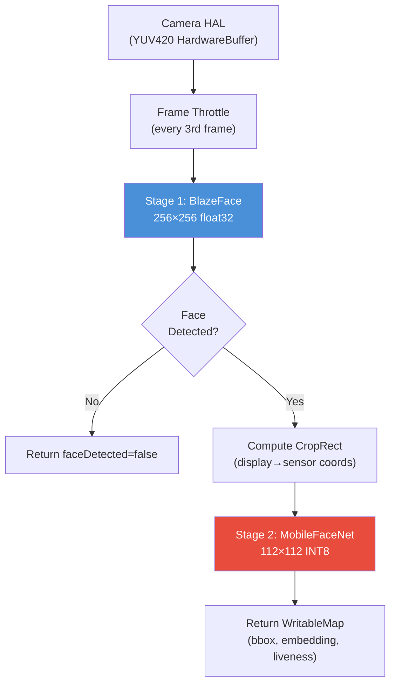

# VerifyIdentity

**VerifyIdentity** is a high-performance, landscape-locked React Native application designed for real-time face verification and liveness detection on low-resource devices (<3GB RAM). 

The app features a zero-copy, two-stage sequential machine learning inference pipeline written in native Kotlin, integrated with **React Native Vision Camera V4** and **React Native Worklets Core**.

---

## 📱 Features

* **Two-Stage Native ML Pipeline**:
  * **Stage 1 (BlazeFace)**: Google MediaPipe BlazeFace (Full-Range/Rear model) for ultra-fast SSD face detection, bounding box extraction, and 6-point facial landmarks mapping.
  * **Stage 2 (MobileFaceNet INT8)**: Quantized MobileFaceNet model running in signed 8-bit integer space for 128-dimensional facial embedding extraction and single-frame liveness classification (anti-spoofing).
* **Zero-Copy Frame Processing**:
  * All memory buffers (YUV planes to RGB, crop matrices) are pre-allocated at startup in direct native `ByteBuffer` objects, avoiding garbage collector heap pressure.
  * Native hardware camera rotation is fused directly into the downscaling transform during pixel decoding, making landscape rotation free of O(W×H) copy overheads.
* **Premium Glassmorphic HUD**:
  * Rich dark-mode UI with HSL tailoring.
  * Corner-bracket biometric bounding box overlays tracking the face.
  * Animated pulse-glow scanning rings.
  * Side-docked stats panel displaying real-time FPS telemetry, liveness scoring bars, and live 128-D vector previews.
  * Color-coded states: `SCANNING` (Blue), `VERIFIED` (Neon Green Glow), and `SPOOF ALERT` (Amber/Red warning).

---

## 🏗️ Architecture



---

## 📦 Standalone APK Download

A pre-compiled standalone debug package is available here:
* 📥 **Download APK**: [VerifyIdentity_debug.apk](file:///C:/Users/worka/.gemini/antigravity/scratch/VerifyIdentity_debug.apk) (140.6 MB)

You can transfer this `.apk` file directly to any Android phone for hardware camera testing.

---

## 🛠️ Local Setup & Build Instructions

### Prerequisites
* **Android SDK**: API Platform 34/36, Build Tools 34.0.0/36.0.0.
* **JDK**: Java 17 (Temurin recommended).

### Model Assets Setup
For the full face verification and liveness checks to function end-to-end (instead of using the automated UI mock fallbacks), copy your TFLite models into:
```
android/app/src/main/assets/
  ├── blazeface_full_range_sparse.tflite
  └── mobilefacenet_int8.tflite
```
*Note: If no models are present, the Kotlin plugin catches the missing asset exception at startup and safely runs in **Stub Mode**, cycling simulated detections, bounding boxes, and embeddings to test the HUD visuals.*

### Running the App
1. Install dependencies:
   ```sh
   npm install
   ```
2. Start the Metro developer bundler:
   ```sh
   npm start
   ```
3. Compile and launch the application on a connected device (forces Landscape orientation):
   ```sh
   npm run android
   ```
4. To compile the standalone `.apk` directly via command line:
   ```sh
   cd android
   ./gradlew.bat assembleDebug
   ```
   The output APK will be placed at `android/app/build/outputs/apk/debug/app-debug.apk`.

---

## 🧪 Mathematical Verification
Mathematical and coordinate mapping logic (including sigmoid numerical stability, IoU overlap scoring, display-to-sensor landscape mapping, and INT8 quantization mapping) was validated through local test suites. 
You can run these validation checks with:
```sh
node verify-math.js
```
